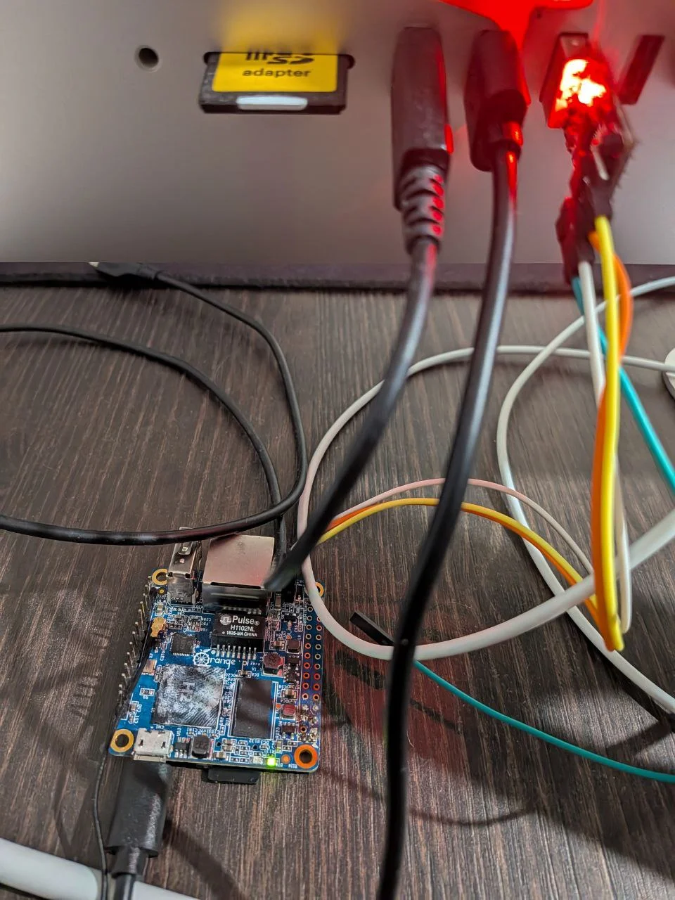
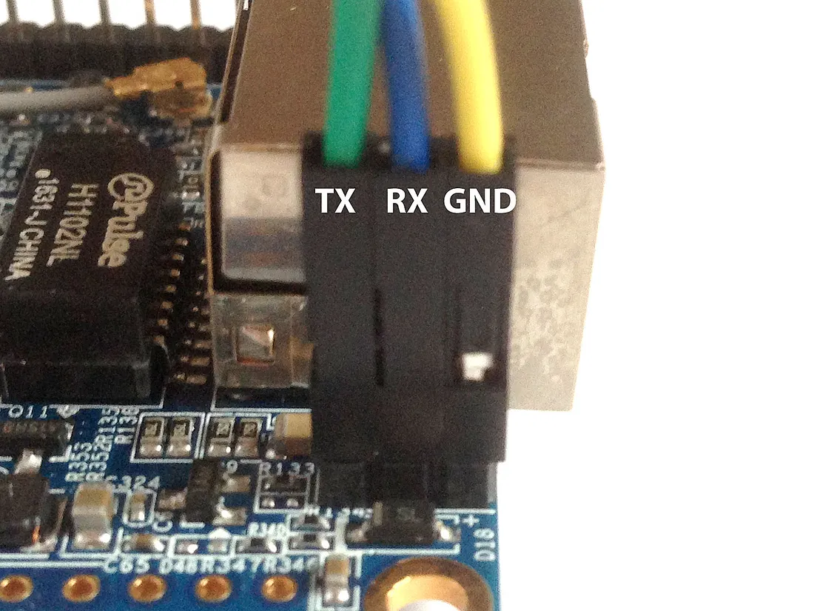
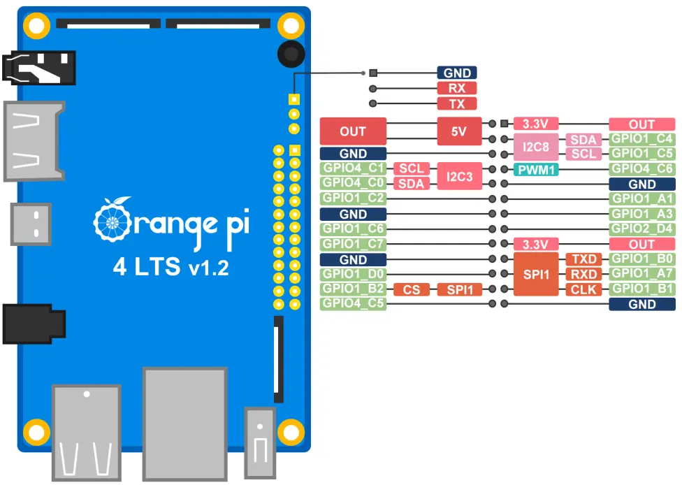

# USB VPN Router

Turn your Orange Pi (or similar SBC) into a secure USB ethernet gadget that routes all connected device traffic through VPN with automatic failover.



## Features

- **USB Ethernet Gadget**: Connect any device via USB and get network access
- **VPN-Only Routing**: All USB client traffic is forced through VPN (no leaks)
- **Automatic Failover**: Seamlessly switches between Tailscale and OpenVPN
- **Split Routing**: Device maintains local network access while clients use VPN
- **Kill Switch**: Traffic is blocked if all VPNs are down
- **IPv4 & IPv6 Support**: Full dual-stack protection

## Quick Start

```bash
# Clone the repository
git clone https://github.com/yourusername/usb-vpn-router.git
cd usb-vpn-router

# Run setup (routes USB clients through VPN)
sudo USE_TAILSCALE_EXIT=true bash setup-usb-router.sh

# Connect your device via USB and it will receive an IP via DHCP
```

## How It Works

1. **USB Gadget Mode**: Creates a USB ethernet interface (`usb0`)
2. **DHCP Server**: Assigns IPs to connected devices (192.168.64.50-150)
3. **Policy Routing**: USB traffic goes through VPN, device keeps local access
4. **Failover Monitor**: Switches between Tailscale/OpenVPN automatically
5. **Kill Switch**: Default DROP policy prevents any leaks

## Configuration

### VPN Setup

**Tailscale (Primary):**
```bash
# Authenticate
tailscale up

# Device will auto-detect available exit nodes
```

**OpenVPN (Backup):**
```bash
# Place config in /etc/openvpn/client/
cp your-config.ovpn /etc/openvpn/client/backup.conf

# Start service
systemctl start openvpn-client@backup
```

### Helper Commands

- `usb-router-status` - Check router and VPN status
- `usb-router-reset` - Reset USB interface
- `usb-router-tailscale on/off` - Control VPN routing
- `usb-router-vpn-monitor status` - Check failover status

## Security

- **No Leaks**: iptables default DROP policy
- **VPN-Only**: USB traffic can ONLY exit through `tailscale0` or `tun0`
- **Kill Switch**: Automatic blocking when VPNs are down
- **Split Routing**: Prevents lockout while securing clients

## Supported Devices

- Orange Pi Zero/One/PC
- Orange Pi 4 LTS (RK3399 with USB-C)
- Raspberry Pi Zero W/2W (USB gadget capable)
- Any Linux SBC with USB OTG support

### Orange Pi Zero Pinout Reference


**Connection Notes:**
- Use the micro-USB port (not the USB-A port) for gadget mode
- UART pins for console access: TX (pin 8), RX (pin 10), GND (pin 6)
- Power can be supplied through micro-USB or GPIO pins

### Orange Pi 4 LTS



## Requirements

- Debian/Ubuntu-based OS
- USB OTG capability
- Root access
- Internet connection for initial setup

## Troubleshooting

**macOS USB Interface Not Active:**
- After connecting the USB cable and allowing the accessory, the interface may appear as "inactive"
- Manually activate it with:
  ```bash
  sudo ifconfig en8 up          # Bring the interface up
  sudo ipconfig set en8 DHCP     # Trigger DHCP client
  ```
- Replace `en8` with your actual interface name (check with `ifconfig -a`)

**macOS "Allow Accessory to Connect" prompt:**
- When first connecting, macOS shows a permission dialog
- The USB interface won't appear until you click "Allow"
- The watchdog service automatically handles this delay
- Check status: `systemctl status usb-interface-watchdog`
- View logs: `tail -f /var/log/usb-interface-watchdog.log`

**No DHCP lease:**
- Check USB cable (must be data cable, not charge-only)
- Verify g_ether module: `lsmod | grep g_ether`
- Check watchdog: `usb-interface-watchdog check`

**No internet access:**
- Check VPN status: `usb-router-status`
- Verify kill switch: `iptables -L FORWARD -n -v`
- Check logs: `journalctl -u usb-router-vpn-monitor -f`

**SSH access lost:**
- Connect via UART/console
- The script now prevents this with split routing
- Emergency fix: `tailscale set --exit-node-allow-lan-access=true`

## License

MIT License - see LICENSE file for details